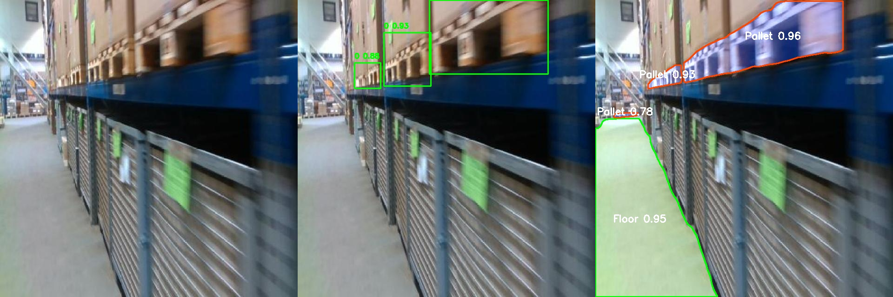
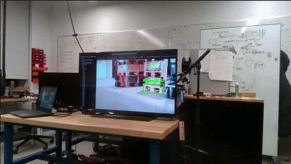
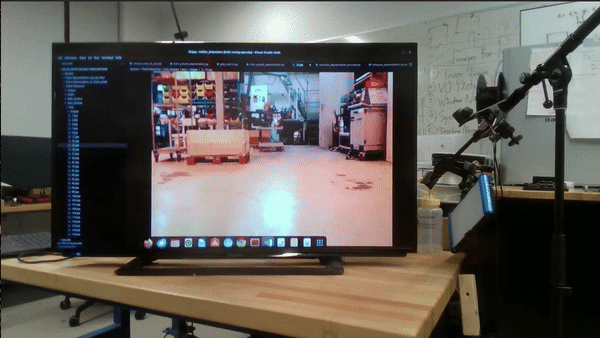
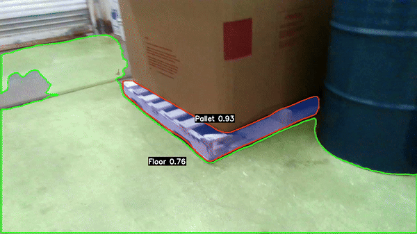
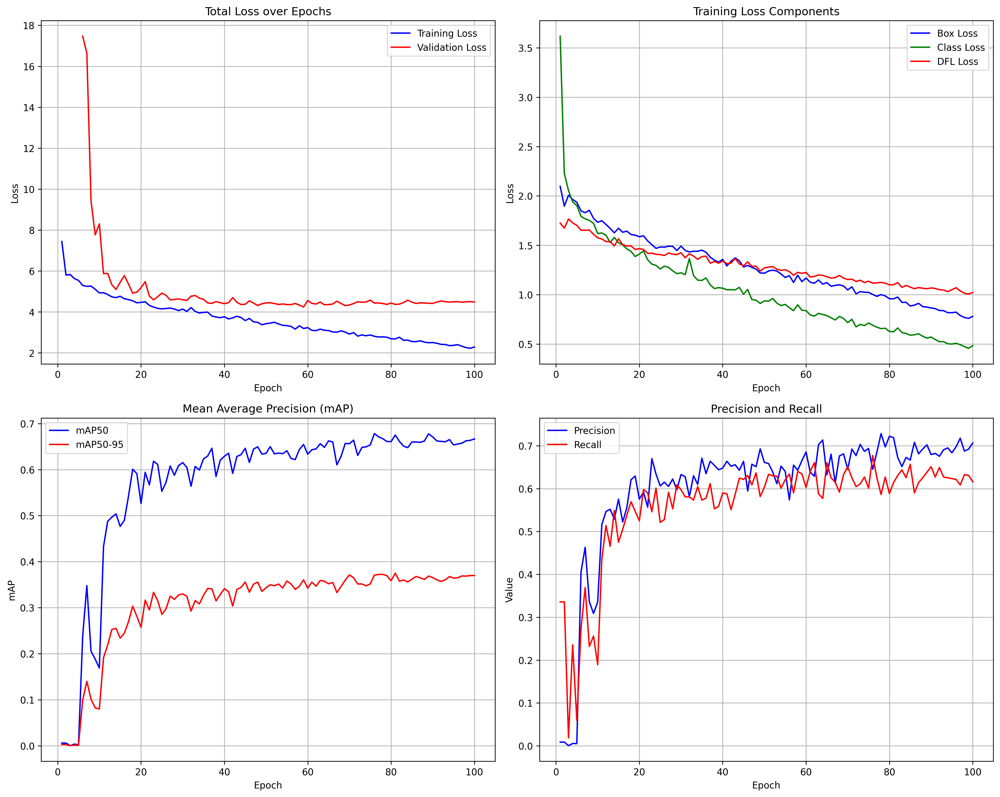
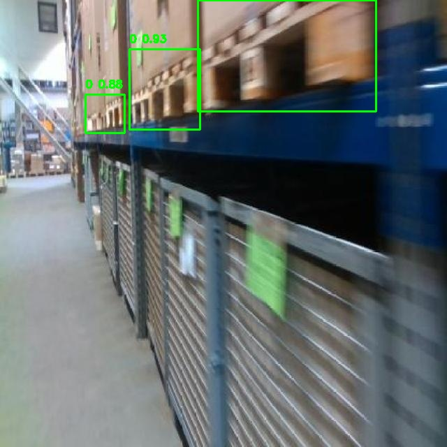
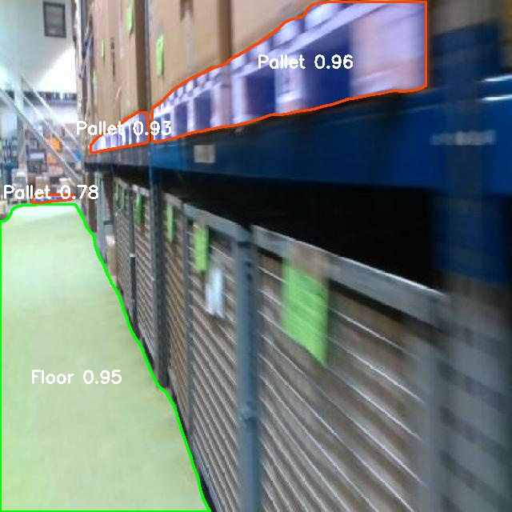

# Pallet Detection and Segmentation in ROS2

</div>
</figure><figure>
<div align="center">

<figcaption>Optimized Model Prediction Deployed on an NVIDIA Orin Nano</figcaption>
</div>

---

## Tasks and Workflow

1. **Dataset Acquisition and Preparation**
   - **Data Preparation:**
     - Tried pre-existing models like DINO. Initial testing revealed suboptimal performance due to insufficient generalization for the targeted application.
     - Consequently, manually annotated 60-70 images using existing available tools like Roboflow and LabelStudio.
     - Fine-tuned the models using the annotated dataset and leveraged the fine-tuned model for auto-labeling the remaining dataset.
     - Applied data augmentation techniques, including brightness adjustment, contrast variation, rotation, and flipping, to enhance dataset diversity and robustness.

2. **Object Detection and Semantic Segmentation**
   - **Model Development:**
     - Utilised YoloV8 for object detection and segmentation. Specifically,due to its balance between computational efficiency and accuracy, making it well-suited for deployment on edge devices.
     - Trained and fine-tuned the models using the prepared dataset.
   - **Performance Evaluation:**
     - Evaluate models using metrics:
       - Object Detection: Mean Average Precision (mAP50) - 0.734892
       - Segmentation: Mean Intersection over Union (IoU) - 0.754581 
     - Tested the models on real-world scenarios across various labs and warehouse on university campus.

3. **ROS2 Node Development**
   - **ROS2 Package:**
     - Develop a ROS2 package containing nodes written in Python.
     - Node Capabilities:
       - Subscribe to image topic.
       - Perform object detection and segmentation.
       - Visualize the results in real-time using OpenCV window.

---

## Quick Links

- [Installation](#installation)
- [Usage](#usage)
  - [Running ROS2 Nodes](#running-ros2-nodes)
    - [Using ROS Bags](#using-ros-bags)
    - [Real-time Camera Feed](#real-time-camera-feed)
  - [Viewing Results](#viewing-results)
    - [Object Detection Results](#object-detection-results)
    - [Semantic Segmentation Results](#semantic-segmentation-results)
  - [Training and Fine-tuning](#training-and-fine-tuning)
    - [Object Detection](#object-detection)
    - [Semantic Segmentation](#semantic-segmentation)
    - [Visualizing Training Metrics](#visualizing-training-metrics)
    - [Metrics and Performance](#metrics-and-performance)
- [Model Optimization](#model-optimization)
  - [Results](#results)

---

## Installation

### Setup Instructions

1. Clone the repository:
   ```bash
   git clone https://github.com/hrishikesh-st/Pallet_Detection.git
   cd Pallet_Detection
   ```

2. Install dependencies:
   ```bash
   pip install -r requirements.txt
   ```

3. Create a workspace:
   ```bash
   mkdir -p pallet_detection_ws/src
   ```

4. Copy the `pallet_detector` package to src and build the package:
   ```bash
   colcon build
   ```

5. Source the setup file:
   ```bash
   source install/setup.bash
   ```

---

## Usage

### Running ROS2 Nodes

ROS2 nodes are implemented for object detection and semantic segmentation. The nodes can be run using the following steps. You can run the nodes on both real-time camera feed or recorded video.

#### Using ROS Bags

1. Download the ROS bag files from the following link:
   - [ROS Bag Link: Real-time Camera Feed](https://drive.google.com/file/d/1k8cXTuex3DLMbwWaHd9s4sS8v38xTyZ1/view?usp=sharing)

2. Play a ROS bag file:
   ```bash
   ros2 bag play <path-to-rosbag>
   ```
3. Download the trained models from the following link:
   - [Model Link: Trained Models](https://drive.google.com/drive/folders/1tYH8X1ABNBdpegmpkLEVGOnUqnz6D0Ra?usp=sharing) 

4. Run the detection node on the provided ROS Bag:
   ```bash
   ros2 run pallet_detector detection_node --ros-args -p model_path:=<path_to_pytorch_model> -p image_topic:=<topic_name>
   ```
   Exmaple for above provided ROS Bag (Intel Realsense D435i):
   ```bash
   ros2 run pallet_detector detection_node --ros-args -p model_path:=<path_to_pytorch_model> -p image_topic:=/color/image_raw
   ```

   Exmaple for the test ROS Bag (Zed2i):
   ```bash
   ros2 run pallet_detector detection_node --ros-args -p model_path:=<path_to_pytorch_model> -p image_topic:=/robot1/zed2i/left/image_rect_color
   ```

5. Run the segmentation node:
   ```bash
   ros2 run pallet_detector segmentation_node --ros-args -p model_path:=<path_to_pytorch_model> -p image_topic:=<topic_name>
   ```

   Exmaple for above provided ROS Bag (Intel Realsense D435i):
   ```bash
   ros2 run pallet_detector segmentation_node --ros-args -p model_path:=<path_to_pytorch_model> -p image_topic:=/color/image_raw
   ```

   Exmaple for the test ROS Bag (Zed2i):
   ```bash
   ros2 run pallet_detector segmentation_node --ros-args -p model_path:=<path_to_pytorch_model> -p image_topic:=/robot1/zed2i/left/image_rect_color
   ```

#### Real-time Camera Feed

For real-time camera feed, you can follow the same steps as above. Make sure to subscribe to the correct image topics based on your camera you are using.


### Viewing Results

Both the detection and segmentation nodes display results in real-time via OpenCV windows. Tested the model on the following scenarios:

#### Object Detection Results
Tested the model on a real-time camera feed (Intel Realsense D435i) and the results were as follows:
<figure>
<div align="center">

<figcaption>Good lighting conditions</figcaption>

</div>
</figure>
<figure>
<div align="center">

<figcaption>Low lighting conditins and shadows</figcaption>

</div>
</figure><figure>
<div align="center">

<figcaption>In a machine workshop</figcaption>

</div>
</figure><figure>
<div align="center">

<figcaption>At an oblique angle and poor contrast monitor</figcaption>

</div>
</figure><figure>
<div align="center">

<figcaption>On a poor contrast monitor</figcaption>

</div>
</figure>

#### Semantic Segmentation Results
Tested the model on a real-time camera feed (Intel Realsense D435i) and the results were as follows:
<figure>
<div align="center">

<figcaption>Segmentation Results</figcaption>

</div>
</figure>

### Training and Fine-tuning

#### Object Detection
1. Download and unzip the annotated dataset. The unzipped dataset should contain images and labels in the `detection_data/` directory. Download the dataset from [Dataset Link: Detection Dataset](https://drive.google.com/file/d/11GC2O1uXLMmL0MzgmFhz64xhOsQjCwp9/view?usp=sharing).

2. Maintain the following structure:
   ```plaintext
   detection_data/
   ├── images/
   │   ├── image1.jpg
   │   ├── image2.jpg
   │   └── ...
   ├── labels/
   │   ├── image1.txt
   │   ├── image2.txt
   │   └── ...
   ```

3. Train the object detection model:
   ```bash
   usage: train_detection.py [-h] --image_dir IMAGE_DIR --label_dir LABEL_DIR --output_dir OUTPUT_DIR [--epochs EPOCHS] [--batch_size BATCH_SIZE] [--imgsz IMGSZ]
   
   Detection Dataset Preparation and Training
   
   options:
   -h, --help            show this help message and exit
   --image_dir IMAGE_DIR
                        Path to the directory containing images.
   --label_dir LABEL_DIR
                        Path to the directory containing YOLO-format labels.
   --output_dir OUTPUT_DIR
                        Path to the output directory for dataset splits.
   --epochs EPOCHS       Number of training epochs (default: 100).
   --batch_size BATCH_SIZE
                        Batch size for training (default: 16).
   --imgsz IMGSZ         Image size for training (default: 640). 
   ```

   Example:
   ```bash  
   python train_detection.py --image_dir <path-to-images> --label_dir <path-to-labels> --output_dir <output-dir>
   ```

Note: Output directory will contain the splitted datset in train, val and test folders along with the data.yaml file.

#### Semantic Segmentation
1. Download and unzip the annotated segmentation dataset. The unzipped dataset should contain images and labels in the `segmentation_data/` directory. Download the dataset from [Dataset Link: Segmentation Dataset](https://drive.google.com/file/d/1UFpLKd2lPZbyMEiV4c9qds9KfA6RSDJ5/view?usp=sharing).

2. Annotated Segmentation dataset is augmented and splitted into train, val and test sets. The     directory structure is as follows:
   ```plaintext
   segmentation_data/
   ├── train/
   │   ├── images/
   │   │   ├── image1.jpg
   │   │   ├── image2.jpg
   │   │   └── ...
   │   └── labels/
   │       ├── image1.txt
   │       ├── image2.txt  
   │       └── ...
   ├── val/
   │   ├── images/
   │   │   ├── image1.jpg
   │   │   ├── image2.jpg
   │   │   └── ...
   │   └── labels/
   │       ├── image1.txt
   │       ├── image2.txt
   │       └── ...
   ├── test/
   │   ├── images/
   │   │   ├── image1.jpg
   │   │   ├── image2.jpg
   │   │   └── ...
   │   └── labels/
   │       ├── image1.txt
   │       ├── image2.txt
   │       └── ...
   ├── dataset.yaml
   ```

3. Train the semantic segmentation model:
   ```bash
   usage: train_segmentation.py [-h] --dataset_path DATASET_PATH --yaml_path YAML_PATH [--epochs EPOCHS] [--batch_size BATCH_SIZE] [--imgsz IMGSZ]
   
   Segmentation Training
   
   options:
   -h, --help            show this help message and exit
   --dataset_path DATASET_PATH
                           Path to the root dataset directory.
   --yaml_path YAML_PATH
                           Path to save the dataset YAML configuration file.
   --epochs EPOCHS       Number of training epochs (default: 100).
   --batch_size BATCH_SIZE
                           Batch size for training (default: 16).
   --imgsz IMGSZ         Image size for training (default: 640).
   ```

   Example:
   ```bash
   python train_segmentation.py --dataset_path <path-to-segmentation_data-containing-above-structure> --yaml_path <path-where-dataset.yaml-is-saved>
   ```

Note: Pass in the path to `segmentation_data` for saving the dataset.yaml file.

#### Visualizing Training Metrics
To visualize the training metrics, run `training_metrics_plot.py` script. This script takes in the result.csv generated in the `runs` directory while training and plots the training metrics.
```bash
usage: training_metrics_plot.py [-h] --csv-path CSV_PATH [--output-dir OUTPUT_DIR]

Plot training metrics from a YOLO training run.

options:
-h, --help            show this help message and exit
--csv-path CSV_PATH   Path to the results CSV file.
--output-dir OUTPUT_DIR
                        Directory to save the plots.
```

Example:
```bash
python training_metrics_plot.py --csv-path <path-to-results.csv> --output-dir <output-dir>
```

Following are the plots generated for YoloV8x detection model training:
<p align="center">
  
</p>

#### Metrics and Performance

To evaluate the performance of the trained models, run the `evaluate_detection_performance.py` and `evaluate_segmentation_performance.py` scripts.

1. To evaluate object detection performance:
   ```bash
   usage: evaluate_detection_performance.py [-h] --model-path MODEL_PATH --data-yaml DATA_YAML
                                         [--img-size IMG_SIZE] [--batch-size BATCH_SIZE] [--plots]
   
   Evaluate detection model performance.
   
   options:
   -h, --help            show this help message and exit
   --model-path MODEL_PATH
                           Path to the YOLO model weights file.
   --data-yaml DATA_YAML
                           Path to the dataset YAML file.
   --img-size IMG_SIZE   Image size for validation (default: 640).
   --batch-size BATCH_SIZE
                           Batch size for validation (default: 16).
   --plots               Generate and save plots.
   ```

   Example:
   ```bash
   python evaluate_detection_performance.py --model-path <path-to-model-weights> --data-yaml <path-to-data.yaml>
   ```

2. To evaluate semantic segmentation performance:
   ```bash
   usage: evaluate_segmentation_performance.py [-h] --model-path MODEL_PATH --data-yaml DATA_YAML
                                            [--img-size IMG_SIZE] [--batch-size BATCH_SIZE] [--plots]
   
   Evaluate segmentation model performance.
   
   options:
   -h, --help            show this help message and exit
   --model-path MODEL_PATH
                           Path to model weights
   --data-yaml DATA_YAML
                           Path to the dataset YAML file.
   --img-size IMG_SIZE   Image size for validation (default: 640).
   --batch-size BATCH_SIZE
                           Batch size for validation (default: 16).
   --plots               Generate and save plots.
   ```

   Example:
   ```bash
   python evaluate_segmentation_performance.py --model-path <path-to-model-weights> --data-yaml <path-to-data.yaml> 
   ```

Follwoing are the metrics for the trained models

Model: YoloV8x

| Metric                      |  Value   |
|-----------------------------|----------|
| Object Detection (mAP50)    | 0.734892 |
| Semantic Segmentation (IoU) | 0.754581 |

---

## Model Optimization

Performed model optimization on a NVIDIA Orin Nano platform. The model was optimized using the ultralytics library to half precision (FP16)

The optimization scripts are in the `ORIN_NANO` directory. The scripts are as follows:

1. `export_trt.py`: Exports the PyTorch model to TensorRT format.
```bash
usage: export_trt.py [-h] --model-path MODEL_PATH [--export-format EXPORT_FORMAT] [--half]

Export pytorch to TensorRT format..

options:
  -h, --help            show this help message and exit
  --model-path MODEL_PATH
                        Path to the YOLO model weights file.
  --export-format EXPORT_FORMAT
                        Format to export the model (default: 'engine').
  --half                Export the model in half precision (default: True).
```

Example:
```bash
python export_trt.py --model-path <path-to-model-weights>
```

Note: Access the ORIN NANO optimized models from the following link:
- [Optimized Models Link: ORIN NANO Optimized Models](https://drive.google.com/drive/folders/1NNnSAefV1PWHm9iA-iKhttixyS5xgjoW?usp=sharing)

2. infer_detect.py: Inference script for object detection.
```bash
usage: infer_detect.py [-h] --image-path IMAGE_PATH --model-path MODEL_PATH [--save-dir SAVE_DIR]
                       [--conf-threshold CONF_THRESHOLD]

Run detection model on an image and save results.

options:
  -h, --help            show this help message and exit
  --image-path IMAGE_PATH
                        Path to the input image.
  --model-path MODEL_PATH
                        Path to the YOLO model file.
  --save-dir SAVE_DIR   Directory to save annotated predictions (default: 'results').
  --conf-threshold CONF_THRESHOLD
                        Confidence threshold for predictions (default: 0.5).
```

Example:
```bash
python infer_detect.py --image-path <path-to-image> --model-path <path-to-model-weights>
```

3. infer_segment.py: Inference script for semantic segmentation.
```bash
usage: infer_segment.py [-h] --image-path IMAGE_PATH --model-path MODEL_PATH [--save-dir SAVE_DIR]
                        [--conf-threshold CONF_THRESHOLD]

Run segmentation model on an image and save results.

options:
  -h, --help            show this help message and exit
  --image-path IMAGE_PATH
                        Path to the input image.
  --model-path MODEL_PATH
                        Path to the YOLO model file.
  --save-dir SAVE_DIR   Directory to save annotated results.
  --conf-threshold CONF_THRESHOLD
                        Confidence threshold for predictions (default: 0.5).
```

Example:
```bash
python infer_segment.py --image-path <path-to-image> --model-path <path-to-model-weights>
```

The inference results from the optimized models are as follows on the NVIDIA Orin Nano platform with half precision (FP16):

#### Results

<div style="display: flex; justify-content: center; gap: 20px; align-items: center;">
  <figure style="text-align: center;">
    
    <figcaption>Detection Prediction</figcaption>
  </figure>
  <figure style="text-align: center;">
    
    <figcaption>Segmentation Prediction</figcaption>
  </figure>
</div>


---